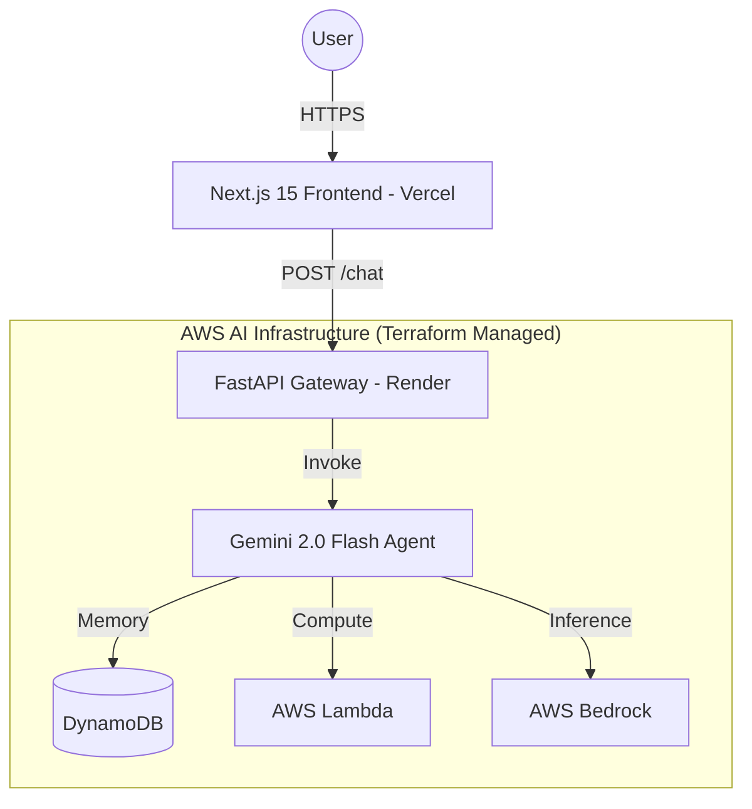

# Sami Rautanen - AI Platform Engineer

Building autonomous AI agent systems and production-grade cloud infrastructure.

---

## 🏗️ Professional Profile

AI Platform Engineer specializing in the design and implementation of autonomous agentic systems and scalable cloud environments. I provide end-to-end technical solutions, from infrastructure automation to high-performance frontends.

---

## 🛠️ Core Expertise

### Cloud & Infrastructure
- **Infrastructure as Code (IaC)**: Fully automated environments using **Terraform**.
- **AWS Ecosystem**: Lambda, S3, DynamoDB, Bedrock, and IAM security.
- **CI/CD**: Automated deployment pipelines using **GitHub Actions**.

### AI & Agentic Systems
- **Autonomous Agents**: Implementing reasoning, tool-calling, and planning workflows using LLMs (Gemini 2.0 Flash).
- **Persistent Memory**: Building long-term context and user-specific memory management.
- **Performance**: Optimizing latency and API orchestration for real-time AI interactions.

### Full-Stack Development
- **Modern Web**: Next.js 15 (App Router), TypeScript, and Tailwind CSS.
- **Backend**: FastAPI, Python, and scalable API architecture.
- **3D Graphics**: Interactive web visualizations with Three.js and React Three Fiber.

---

## 📊 System Architecture

---

## 🎯 Featured Projects

- **AgentSquad BI**: Multi-agent Sales Intelligence and Deep Research platform.
- **EngineeringTeam Crew**: Autonomous 5-agent software development team building Python applications.
- **Sidekick AI Agent**: LangGraph-powered autonomous assistant with self-correction and tool use.
- **Autonomous Digital Twin**: Live AI agent system (AWS/Terraform) with persistent memory.

---

## 🚀 Future Roadmap (In Planning)

- **CareAssist AI**: Enterprise-grade healthcare agentic system for parsing notes and triage.
- **ContractSense AI**: SaaS platform for legal risk analysis and PII protection.

---

## 🛠️ Technical Stack

- **AI/ML**: Gemini 2.0 Flash, OpenAI, LangChain principles.
- **Cloud**: AWS, Terraform, GitHub Actions, Vercel.
- **Frontend**: Next.js 15, TypeScript 5, Tailwind CSS, Framer Motion.
- **Backend**: FastAPI, Python 3.12, Pydantic.

---

## 🤝 Connect

- **LinkedIn**: [Sami Rautanen](https://linkedin.com/in/sami-rautanen)
- **GitHub**: [@Samrude1](https://github.com/Samrude1)
- **Email**: samrude1@outlook.com
- **Website**: [samirautanen.fi](https://samirautanen.fi)

---
**AI Engineering & Cloud Architecture**
